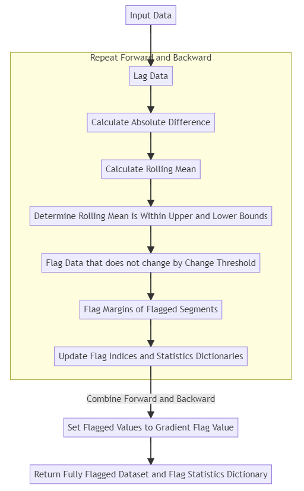
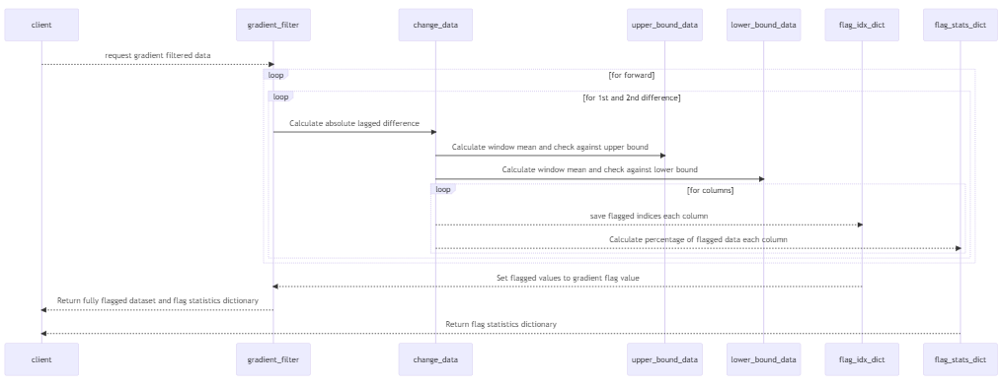
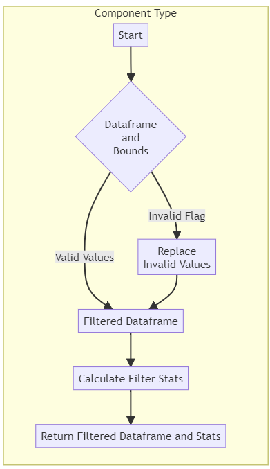
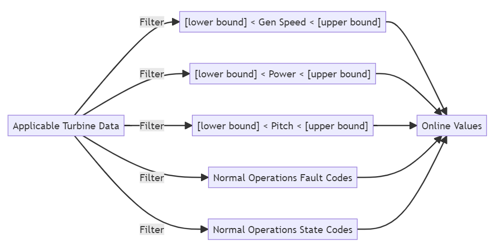
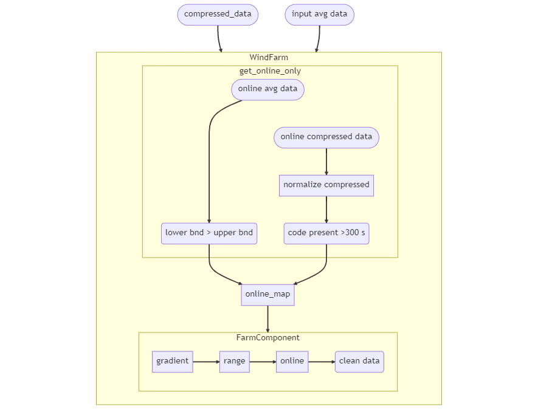

# AI <sup>2</sup> Clean Data
There are 3 cleaning methods employed. They are executed on the data in this order: 
1. Gradient Filtering
2. Range Filtering 
3. Online Filtering

Here is the detailed sequence. 

1. Client requests clean data 
2. App Looks in [cleaning order](data_dictionary.md#cleaning_order) constant
3. App Applies [gradient filtering](#gradient-filtering-process)
4. App Applies [range filtering](#range-filtering)
5. App Applies [online filtering](#online-filtering)
6. App combines the boolean maps returned from each cleaning method and returns as clean data.  

## Gradient Filtering 

Gradient filtering attempts to remove data that does not change normally. Either it is flat (or changes too little) for too long or has a constant slope. Constant slopes are seen when historians interpolate across missing data periods between two valid data points. 

Here are the steps of gradient filteriing:



Here is how the objects interact to perform gradient filtering:

## Range Filtering

Apply simple range filters to remove unrealistic or impossible values. 

The process is simple and is as follows:


## Online Filtering
The purpose of online filtering is to filter values to those where the turbine is under normal load -- not offline, curtailed or otherwise hindered. Online filtering logic is illustrated below:



Gen speed, power, and pitch data are all [10 minute average data](data_dictionary.md#time-weighted-average-pi) and are filtered simply. Fault Codes and state codes however, are [compressed data](data_dictionary.md#compressed-data) and must be transformed first so they line up with ten minute data. The code responsible for this is the [normalize_compressed](reference.md#auto-issue-id-application.Utils.Transformers.normalize_compressed) method.  

Here is another image that shows online filtering in the context of [WindFarm](reference.md#auto-issue-id-application.Model.WindFarm.WindFarm) and [FarmComponent](reference.md#auto-issue-id-application.Model.WindFarm.FarmComponent) objects.



[WindFarm.__init__](reference.md#auto-issue-id-application.Model.WindFarm.WindFarm.__init__) creates a [FarmComponent](reference.md#auto-issue-id-application.Model.WindFarm.FarmComponent) object for each component type found in the average file.[WindFarm.__init__](reference.md#auto-issue-id-application.Model.WindFarm.WindFarm) passes into [FarmComponent](reference.md#auto-issue-id-application.Model.WindFarm.FarmComponent) init the [online_map](reference.md#auto-issue-id-application.Model.WindFarm.WindFarm.online_map). If it has not been created yet then the windfarm method [get_online_only](reference.md#auto-issue-id-application.Model.WindFarm.WindFarm.get_online_only) will run.

When [WindFarm.__init__](reference.md#auto-issue-id-application.Model.WindFarm.WindFarm.__init__) runs, a compressed file path is passed in addition to the average file path.[get_online_only](reference.md#auto-issue-id-application.Model.WindFarm.WindFarm.get_online_only) now opens that compressed file and loads it to a dataframe. [get_online_only](reference.md#auto-issue-id-application.Model.WindFarm.WindFarm.get_online_only) then retrieves from constants [ONLINE_FILTER_PARAMETERS](data_dictionary.md#online_filter_parameters) for this project. [ONLINE_FILTER_PARAMETERS](data_dictionary.md#online_filter_parameters) is a dictionary with keys of column type enum values and the filter criteria as values or entries in the dictionary.

For example:

```python
ONLINE_FILTER_PARAMETERS = {
    "BR2": {
        "GE_2_72_116": {
            ComponentTypes.GEN_SPEED.value: {"lower_bound": 825, "upper_bound": 1550},
            ComponentTypes.ACTIVE_POWER.value: {"lower_bound": 5, "upper_bound": 2720},
            ComponentTypes.PITCH_ANGLE_A.value: {"lower_bound": -5, "upper_bound": 50},
            ComponentTypes.FAULT_CODE.value: {"normal_codes": [2]},
            ComponentTypes.OPERATING_STATE.value: {"normal_codes": [16, 30, 602]},
        },
```

For each item in the [ONLINE_FILTER_PARAMETERS](data_dictionary.md#online_filter_parameters) dictionary: if the column type is compressed,
which is also looked up in constants from the [COMPRESSED_COLUMN_TYPES](data_dictionary.md#compressed_column_types) dict, then [normalize_compressed](reference.md#auto-issue-id-application.Utils.Transformers.normalize_compressed) is called. 

[normalize_compressed](reference.md#auto-issue-id-application.Utils.Transformers.normalize_compressed) converts irregular time-stamped code data such as turb-state-scada and err-code and converts to 10-minute boolean grid. This is  based on whether the codes stored in the online filtering params dict specifically keyed with "normal_codes", are present for greater than half of each 10- minute period.

If the column type returned in the ONLINE_FILTER_PARAMETERS dictionary is NOT a compressed type, then the subset is retrieved by component_type from the master average data set. Then a boolean mask is created for this dataframe by filtering with upper and lower bound for this column type. 

Finally, [get_online_only](reference.md#auto-issue-id-application.Model.WindFarm.WindFarm.get_online_only)  creates a combined data map, by combining the individual maps created for each column type in the ONLINE_FILTER_PARAMETERS Dict and returns back to the WindFarm online_map property. 

This map is then injected into the constructor for [FarmComponent](reference.md#auto-issue-id-application.Model.WindFarm.FarmComponent). 

When the [clean_data](reference.md#auto-issue-id-application.Model.WindFarm.FarmComponent.clean_data) property is called on any [FarmComponent](reference.md#auto-issue-id-application.Model.WindFarm.FarmComponent) object, the online_map mask that was injected on init is retreived and applied to the [FarmComponent](reference.md#auto-issue-id-application.Model.WindFarm.FarmComponent) object's dataset.

Online only data is needed for analysis of [Power Performance](user_guide.md#power-performance),[Power Curves](user_guide.md#level-i-power-curve-and-aep-and-distribution), [Component Temperatures](user_guide.md#component-temperatures), and [Online Yaw Error](user_guide.md#static-yaw-error).


The [efficiency](data_dictionary.md#efficiency) data is encapsulated by a [CalculatedFarmComponent](reference.md#auto-issue-id-application.Model.WindFarm.CalculatedFarmComponent) object. These are created in [WindFarm](reference.md#auto-issue-id-application.Model.WindFarm.WindFarm) init after the base [FarmComponent](reference.md#auto-issue-id-application.Model.WindFarm.FarmComponent) objects have been created. [CalculatedFarmComponent](reference.md#auto-issue-id-application.Model.WindFarm.CalculatedFarmComponent) objects are some combination of [FarmComponent](reference.md#auto-issue-id-application.Model.WindFarm.FarmComponent) objects  and so all filtering applied to the individual composing [FarmComponent](reference.md#auto-issue-id-application.Model.WindFarm.FarmComponent) objects is communicated to the resulting [CalculatedFarmComponent](reference.md#auto-issue-id-application.Model.WindFarm.CalculatedFarmComponent) object. In other words when we divide [Active Power](data_dictionary.md#active-power) by [expected power](data_dictionary.md#expected-power) to derive turbine [efficiency](data_dictionary.md#efficiency) while efficiency is not online filtered directly, online filtering is communicated to efficieny through having been applied to its numerator and denominator. 


   


