# Raw Data

## Active Power
Power production mesured at the Turbine. 

- [10 minute average data](#time-weighted-average-pi), downloaded in UTC with time stamp indicating time beginning. 
- One tag per turbine
## Expected Power
The expected power as indicated by running [10 minute average](#time-weighted-average-pi) [Air Density Adjusted Wind Speed](#air-density-adjusted-nacelle-wind-speed) through the  [OEM Power Curve](#oem-power-curve). 

This yields a 10 minute expected power daat stream that is used for [efficiency](#efficiency), [Lost Energy](#lost-energy), and [Lost Revenue](#lost-revenue) calculations in AI2. 

- This is precalculated in SPC's PI Historian
- Downloaded as [10 minute average data](#time-weighted-average-pi)
- Downloaded in UTC with time stamp indicating time beginning. 
- One tag per turbine
## Component Temperatures
Temperatures of important turbine components such as nacelle, hub, high speed and intermediate shaft etc...

- [10 minute average data](#time-weighted-average-pi), downloaded in UTC with time stamp indicating time beginning. 
- Many possible tags per turbine. 
- In degrees Celcius
## Air Density Adjusted Nacelle Wind Speed
To properly use the [OEM Power curve](#oem-power-curve) to map wind speed to expected power output the wind speeds must be adjusted as a function of air density. The higher the density, the more popwer in the wind so the wind speed is adjusted up or down to yield an appropriate power value from the [OEM Power curve](#oem-power-curve). 

$$ V_{\text{adj}} = V \times \left( \frac{\rho}{\rho_0} \right)^{\frac{1}{3}} $$

$$
\begin{align*}
&\text{where:} \\
&V_{\text{adj}} \text{ is the adjusted wind speed,} \\
&V \text{ is the original wind speed,} \\
&\rho \text{ is the air density at the site,} \\
&\rho_0 \text{ is the reference air density (often taken as } 1.225 \, \text{kg/m}^3 \text{ at sea level under standard conditions).}
\end{align*}$$
## Blade Pitch Angle
The angle between the blade's chord line (an imaginary straight line between the leading and trailing edges of the blade) and the plane of the rotor disc.
- [10 minute average data](#time-weighted-average-pi), downloaded in UTC with time stamp indicating time beginning. 
- Three tags per turbine: Blade A,B, and C
## Fault Code 
An integer code indicating a significant event at the turbine. The event may or may not cause the turbine to shut down.  

- Downloaded as [compressed data](#compressed-data),and in UTC.
- One tag per turbine. 
## State Code
An integer code indicating a the current state of  the turbine. 

- Downloaded as [compressed data](#compressed-data),and in UTC.
- One tag per turbine. 
## Yaw Position
The absolute direcection the turbine nacelle is facing. 

- [10 second sampled data ](#sampled-data-pi), downloaded in UTC.
  
- One tag per turbine for non-GE Turbines. The GE turbines offer the precalculated yaw error in the [Nacelle Wind Direction](#nacelle-wind-direction) tag. 
## Nacelle Wind Direction
The absolute direction of the incoming wind relative to the turbine nacelle in non-GE turbines. In GE turbines this is the delta between the [Yaw Position](#yaw-position) and the incoming wind direction. 

- [10 second sampled data ](#sampled-data-pi), downloaded in UTC.
  
- One tag per turbine 
# UI Input Data Sets
## Power Curve Data Set

`power_curve.csv`

Daily [bin centered](data_dictionary.md#bin-centering) 0.5 m/s power curves are [precalculated](transformation_model.md#power-curve-calculation-transformation-engine) by the transformation engine and output to a file named `power_curve.csv`. This file also contains the plant [OEM Power Curve](data_dictionary.md#oem-power-curve), the [Daily Park Average Power Curves](transformation_model.md#park-average-power-curve-calculation), and the [Daily Turbine Power Curves](transformation_model.md#power-curve-calculation-transformation-engine).

The File is structured like this:
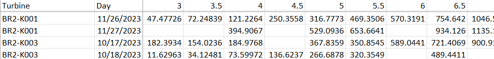

There are 3 types of rows in the file:
1. [OEM Power Curve](data_dictionary.md#oem-power-curve). This is passed to [PowerCurve](reference.md#auto-issue-id-application.Model.PowerCurve.PowerCurve) via the constructor. There is a single row for this power curve per project. 
2. Turbine Power Curves : These are the [calculated power curves](transformation_model.md#power-curve-calculation-transformation-engine) by Turbine and Day. 
3. [Park Average Power Curves](transformation_model.md#park-average-power-curve-calculation) is added as another set of rows to this  file. 

the number of rows = turbines * days

## Power Curve Bin Counts

`power_curve_counts.csv`

These are daily bin counts corresponding to the the daily power curve data set. When power curves are [calculated](transformation_model.md#power-curve-calculation-transformation-engine), the corresponding bin counts are also calculated and output. 

The file consumed by the UI is named `power_curve_counts.csv`

It is structured like this (exactly the same as [power curves](#power-curve-data-set) just with bin counts instead of mean power values. 

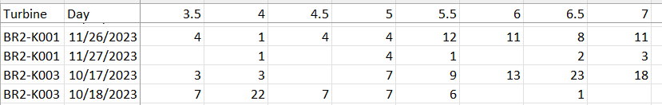

the number of rows = turbines * days

## Treemap 

`treemap_data.csv`

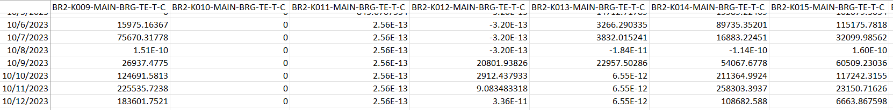

This file contains temperature severities and [means](#daily-mean-temperature) that are used in the [Component Temperature Treemap](user_guide.md#component-temperatures)

Note: Because all raw data streams are `FarmComponent` objects they receive default processing including [severity](data_dictionary.md#severity) calculation  for non temperature columns such as power, wind speed and pitch. These non temperature severities are not currently used in any visualizations but left in the dataset in the case that they become useful in the future. 

## Treemap data simple efficiency
`treemap_data_simple_efficiency.csv`

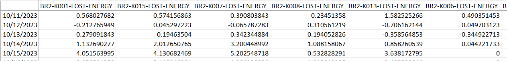

This is a daily aggregated file that contains:
1. [Lost Energy](data_dictionary.md#lost-energy) [Severity](data_dictionary.md#severity)
2. [Lost Revenue](data_dictionary.md#lost-revenue)
3. [Efficiency](data_dictionary.md#efficiency)
4. [Lost Energy](data_dictionary.md#lost-energy)

## Radial Yaw Error

`radial_yaw_error.csv`  

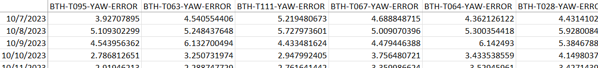

## Daily Turbine Faults
`daily_turbine_fault.csv`

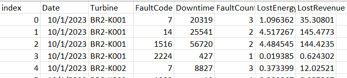

## Downtime Lost Energy
`downtime_lost_energy.csv`

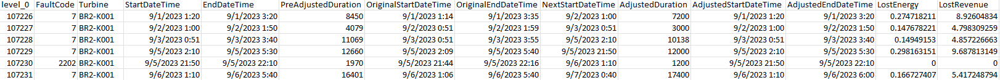

FaultCode
Turbine
StartDateTime
EndDateTime
PreAdjustedDuration
OriginalStartDateTime
NextStartDateTime
AdjustedDuration
AdjustedStartDateTime
AdjustedEndDateTime
LostEnergy
LostRevenue

## Data Recovery Report
While not directly included in the UI visualizations, this grid of data can be produced after running the data transformation engine. It will output a grid of statistics for each tag and the data removed for that tag for gradient, range , and online filtering respectively. 

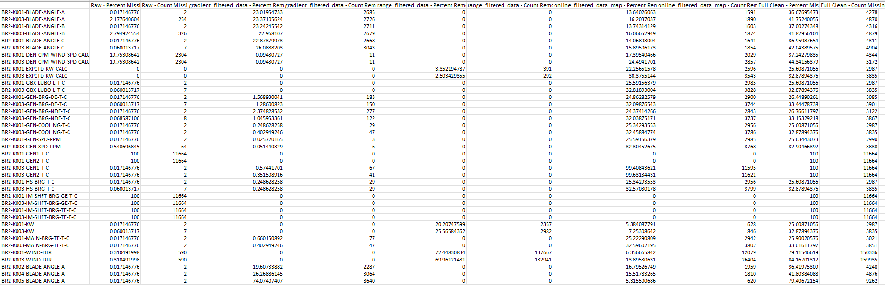

The file reports on the data missing from the raw data, removed by [gradient filtering](data_cleaning_and_filtering.md#gradient-filtering), [range filtering](data_cleaning_and_filtering.md#range-filtering), and  [online filtering](data_cleaning_and_filtering.md#online-filtering). For each of these steps  the file reports the count and the percent rendered missing. In the raw case it is simply what is missing from PI. The final **Full Clean** columns report on the total amount missing from the original data set after all cleaning steps were applied to the raw data. 
 
# AI 2 Calculations

## Annual Energy Production

Given:

- \( P(v) \): Power output of the turbine at specific wind speed \( v \).
- \( f(v) \): Normalized frequency or proportion of the total time the wind blows at speed \( v \) over a year.
- \( n \): Number of wind speed bins.
- Total hours in a year \( H \) (assuming a non-leap year): 8760 hours.

The formula for AEP, taking into account the normalized frequencies, is:

$$
AEP = \sum_{i=1}^{n} P(v_i) \times f(v_i) \times H
$$

Where \( AEP \) is expressed in  MWh, and \( f(v_i) \) is the normalized frequency for the \( i^{th} \) bin.

## Annual Energy Production Delta Percent
Given:

- \( AEP_{target} \): Annual Energy Production of the target turbine.
- \( AEP_{other} \): Annual Energy Production of the other turbine.

The formula for percent change in AEP is:

$$
\text{Percent Change} = \left( \frac{AEP_{target} - AEP_{other}}{AEP_{other}} \right) \times 100\%
$$

## Average Power Curves Over Days
The transformation engine outputs daily power curves for each turbine. When the user selects a date range to view power curves over, the system doea not take a straight average , but considers the bin caounts to take a bin weighted average power curve. This is important in this case because the bin counts can be somewhat low so this mitigates the potential skewing of the power curves due to low count bins. 

## Collapsing power curves by Bin
When calculating [AEP](#annual-energy-production) we must take the sum product of a power curve against a wind speed distribution. In our case, we have acces to integer resolution wind speed distributions. SO before we multiply the power curve, which is in .5 m/s wind speed bins, we collapse those power curves to be 1 m/s bins. To do this we take the weighted average of the neigboring .5 m/s bins across each integer bin by considering the .5 m/s bin counts. 

## Daily Mean Temperature
The transformation engine outputs daily mean temperatures from turbine components. These are the average of the cleaned ten minute data per day per turbine and component.  

## Downtime
Calculated from the [fault code data](#fault-code), this is the time that a turbine is not producing due to a fault(s) occurrence. 

## Efficiency
The proportion of expected power accounted for by actual production of the turbine. 

This is calculated using [Active Power](#active-power) and [Expected Power](#expected-power)

$$
\text{Efficiency (\%)} = \left( \frac{\text{Active Power}}{\text{Expected Power}} \right) \times 100
$$

## Lost Energy
Lost energy is clculated as [Active Power](#active-power) - [Expected Power](#expected-power) 

The result is a 10 minute data stream. 

The amount of energy, in MWh, that is not generated relative to what was expected from the turbine over the selected period of time. No other variables influence this metric.   

## Lost Revenue
[Lost Energy](#lost-energy) is used as an input against the [Revenue Per MWh](#revenue-per-mwh) meta data to convert it to Lost Revenue. 

## Revenue Delta
The amount of money lost or gained relative to what was expected from the turbine over the selected period of time. The [cost per MWh](data_dictionary.md#revenue-per-mwh) varies every month and for every site. 

Note that The values in the [Revenue Per MWh](#revenue-per-mwh) file are hourly.
## Severity
ALso called **Relative Variation**
By design, every project's turbines run at different power outputs, temperatures, and normal levels of yaw error. **Severity/Relative Variation** is introduced as a normalized metric that allows us to compare technologies and project to one another. Whatever the metric we want to compare (eg. temperature, lost energy, yaw error...),  calculate the farm average  of that statistic and compare each turbine's corresponding aggregate value to it.   

The **window severity score** for a particular turbine, over some window of time, on a specific metric, is defined as the  number of standard deviations that turbine's aggregated value is away from the corresponding farm mean of that same metric. Window severity scores summed over a longer period of interest (i.e. a week) are the final **severity score** for each turbine. Those final scores are ranked in descending order and shown on the dashboard. 

To calculate the **severity score** for a turbine, we must first compute the **window severity score** for each time in our period of interest (eg. a week), then sum them all up.

The types of severity the system currently calculates are:  
1. Lost Energy  
2. Temperature  
3. Yaw Error  

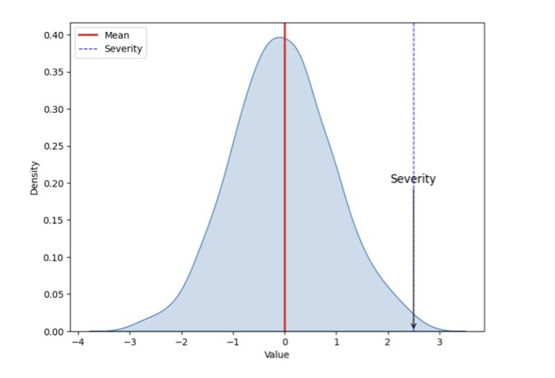

### Severity Calculation Steps 

1. Start with clean 10-minute values from all wind turbines  
2. Calculate farm average and standard deviation for each time stamp
3. Calculate Z score - the number of standard deviations from the park mean each turbine, each timestamp  
4. Filter values less than N standard deviations away from the park mean  
5. Create 6 Hour Rolling window on each turbine's Z-Scores  
6. Sum Z-Scores in each 6 hour window where valid Z-score count > 90%  
7. Sum 6 Hour Window Z-Scores into Daily Severity and output to CSV  
8. User Selects Date Range and Daily Severity Summed from CSV and Rendered in Application  
    
   

### Severity, Revenus Delta, and Lost Energy  

In the application you can view Power performance in a treemap by three different metrics:  

1. **Revenue Delta**: The amount of money lost or gained relative to what was expected from the turbine over the selected period of time. The cost per MWh varies every month and for every site.  

2. **Lost Energy**: The amount of energy, in MWh, that is not generated relative to what was expected from the turbine over the selected period of time. No other variables influence this metric.   

3. **Severity/Relative Variation**: A measurement of the deviation in performance relative to the rest of the wind farm (and class) where the turbine belongs over the selected period of time. Higher severity indicates higher separation between actual and expected power than the other turbines in the site.  

**Why do we care about Severity, Revenue delta, and Lost Energy?**

Each metric gives a different perspective which on its own is valuable to a different audience. 

The most obvious metric is revenue delta because it will quickly tell us where the most expensive issues are. That’s why we want the tool to show that metric by default. But as performance engineers, we must treat every turbine as if they were worth the same. 

That’s where severity comes in. With the severity metric, we can determine which turbines are behaving differently from the rest of the farm, without being blinded or skewed by a financial metric. If a turbine is underperforming relative to its peers, we will want to investigate it and bring it to the attention of the site manager regardless of where the site falls in terms of absolute $/MWh. We have seen how different some Actual vs. Expected power curves have been when validating what the tool has told us. We’ve been able to identify derates, and suspected anemometer issues thanks to the metric that singles out turbines from the rest. 

Lastly, lost energy is valuable because it is theoretically separated from other influences. For example, let’s use the most recent find at GSW where all turbines were derated due to high environmental temperatures. I may not see that on my Lost Revenue metric because GSW does not have a relatively high $/MWh, I also may miss it from the Severity metric because all turbines are behaving expectedly the same way (they all had the same derate so the mean was similar). I should see it on Lost Energy however, and I should notice that a lot of the tree map tiles are from the same site, which would have helped me identify the observation faster.
 

# Configuration 
## CLEANING_ORDER
a list of strings that defines the the name and order of the properties on the FarmComponent class that are used to clean the data. the properties must be exactly as they appear in the class as they are called with getattr(). 
## FarmComponent.clean_data
this order is applied when the FarmComponent.clean_data property is accessed using getattr to access each clean type property in turn. For example, if the CLEANING_ORDER is set as `['gradient_filtered_data',
                   'range_filtered_data',   
                   'online_map']`
then the `FarmComponent.gradient_filtered_data` is called followed by FarmComponent.range_filtered_data, followed by FarmComponent.online_map. the final output of clean_data then is the fully cleaned FarmComponent dataset. 
## FarmComponent.calculate_data_removal_stats()
CLEANING_ORDER is used here as a default to process the number of points used by each cleaning method. It is by design that the same list of methods is used by the clean_data property itself, and here so that there is no mismatch between the cleaning of the data and the reporting on the cleaning of the data. 
## DEFAULT_PARSE_FUNCS
a dictionary of lambda functions use to parse information form column names in input files and in other places in the application
## turbine_name_func
this splits a column name by "-" then takes the first two segments like "BTH-T001-KW" -> "BTH-T001"
## component_name_func
splits a column name by "-" and takes all segments to the right of the right of the first two segments: "BTH-T001-KW" -> "KW". This provides the basis for the farm components that are created when data are processed. 
## project_func
similar to turbine_name_func but only takes the first segment, which in SPC's PI tag convention is always the project. "BTH-T001-KW" -> "BTH"
## PROJECT_SUBSETS
a dictionary listing the turbines that belong to subsets if they exist in a project. This allows like technologies to be processed separately when there are multiple on a single project. 
## TURBINE_TECH
this is a dictionary that defines the rated turbien capacity of each turbine type. {project{substype:capactiy in MW}}. One place this is used is to scale power before calculating efficiency.
## KEY_TO_NAME
A dictionary whose purpose is to map strings found with the **component_name_func** described above to humanized string values that are used to refer to these components in the application. 
for example:
`"GEN-BRG-DE-T-C": ComponentTypes.GENERATOR_BEARING_DRIVE_END.value`
"GEN-BRG-DE-T-C" will be parsed out of a subset of column names in the input data and this is then mapped to the value of GENERATOR_BEARING_DRIVE_END ComponentTypes Utils.Enums value.  
**KEY_TO_NAME** is used in the following areas in the application: 
- [FarmComponent.get_flagged_turbines()](reference.md#auto-issue-id-application.Model.WindFarm.FarmComponent.get_flagged_turbines)  
-  [Helpers.component_type_map()](reference.md#auto-issue-id-application.Utils.Helpers.component_type_map) which wraps **KEY_TO_NAME** and is used to convert back and forth between component types found in pi tags and property names used in the application.  
-  Utils.Treemap.generate_power_performance_treemap and Utils.Treemap.generate_comp_temp_treemap to convert raw column names to humized names for disply in the power performance chart and component temperature chart respectively. 
## GRADIENT_FILTER_PARAMETERS
a dictionary that specifies for each project, turbine type, and component type:
    1. change_threshold: the amount values need to change by to NOT be marked for removal
    2. upper_bound: the threshold, above  which the gradient logic is no longer applied
    3. lower_bound: the threshold below which gradient is no longer applied
    4. repeat_threshold: the number of timestamps repeated where the value does not chnage by change_threshold. beyond which the full segment that meets the threshold is marked for removal. 
    5. diff_depth: the number of times to difference the data. if 1 only take the first difference and subject to these criteria. if 2 also take the difference of the differences (2nd deriv) and evaluate the changes with these same criteria. 
   
this definition is used in [Filter.gradient_filter](reference.md#auto-issue-id-application.Model.Filter.gradient_filter) and is called by the gradient_filtered_stats and gradient_filtered_data properties in FarmComponent. 
## RANGE_FILTER_PARAMETERS
a dictionary that specifies for each project, turbine type, and component type:
1. lower_bound: if value is below this, flagged for removal 
2. upper_bound: if value is above this, flagged for removal
3. invalid_flag: the value used to flag for removal 

used in [Filter.range_filter](reference.md#auto-issue-id-application.Model.Filter.range_filter) and is called by the range_filtered_stats and range_filtered_data properties in FarmComponent. 
## COMPRESSED_COLUMN_TYPES
a dictionary defining for each project the column types that are expected to be compressed in format. 

These are used to know when to call [Utils.Helpers.normalize_compressed](reference.md#auto-issue-id-application.Utils.Helpers.normalize_compressed) which is used when executing online filtering at the moment since fault and state come as compressed values and must be normalized to 10 minute values before being applied as filtering criteria to other 10 minute data. 
## ONLINE_FILTER_PARAMETERS
a dictionary that specifies for each project, turbine type, and component type (Enum value used as key) the parameters necessary to execute logic to remove non-online turbines from consideration: 

gen speed value:    
   - lower_bound: rpm value that gen needs to be at before being considered online
   - upper_bound: rpm value that gen can not exceed to be considered online   

active power:  
   - lower_bound: must be producing at least this many Kw before being considered online
   - upper_bound: can not exceed this in Kw production to be considered online 

pitch_angle:  
   - lower_bound: must be above this degree mark to be considered online 
   - upper_bound: must be below this degree mark to be considered online 

fault_code:
   - normal_codes: this is a list of integers that will be used by Utils.Helpers.normalize_compressed to report how many seconds of each 10 minute period are occupied by these codes. if the time within a given ten minute period that all codes are present is less than 300 seconds then the turbine is not considered to be online

turbine_state_scada:  
- the same logic is used here as for fault codes. 

# AI2 Concepts 

## Swinging Door Algorithm
The OSIsoft PI System's Swinging Door Algorithm is a data compression technique used to reduce the amount of data stored in the PI Archive, which is part of the PI Historian. The algorithm selectively stores data points based on their significance and the degree of deviation from a linear trend. 

Starting Point: The algorithm begins with a starting data point and establishes a linear trend from this point.

Trend Deviation Check: As new data points arrive, the algorithm checks how much each point deviates from the current linear trend.

Swinging Door Criteria: A "door" is imagined to swing open from the starting point. As long as new data points stay within the bounds of this swinging door (i.e., within a predefined deviation limit), the algorithm continues to consider them as part of the linear trend.

Exceeding Deviation Limit: If a new data point falls outside the bounds of the door (exceeding the deviation limit), the last point within the bounds is marked as significant and stored in the archive.

New Trend Establishment: The algorithm then starts a new linear trend from the last significant point. This process of checking deviations and storing significant points continues throughout the data stream.

Data Reduction: This approach significantly reduces the number of data points stored by only archiving those points that represent significant changes in the trend, rather than storing every data point.

Preserving Data Integrity: Despite the reduction in data points, the algorithm is designed to preserve the overall shape and characteristics of the original data, ensuring that important information is not lost in the compression process.

Configurability: Users can configure the deviation limits and other parameters of the Swinging Door Algorithm to balance between the level of data compression and the fidelity of the archived data to the original data stream.

for more details see [Swinging Door Algorithm](https://gfoidl.github.io/DataCompression/articles/SwingingDoor.html)

## Compressed Data
Compressed data in OSIsoft PI refers to the reduced volume of process data stored in the PI System's Historian. Using algorithms like the [Swinging Door Algorithm](#swinging-door-algorithm), OSIsoft PI compresses data by storing only significant data points that represent changes in the data trend, while omitting less informative points. This approach attempts to maintains data integrity while reducing storage needs.

In the [download utility](#pi-download-utility) compressed data is requested like this: `"SELECT [time], [value] FROM piarchive..picomp2 WHERE tag =('PDK-T001-ERR-CODE') AND [time] BETWEEN '####' AND '####' ORDER BY  [time]"`

output looks like this:
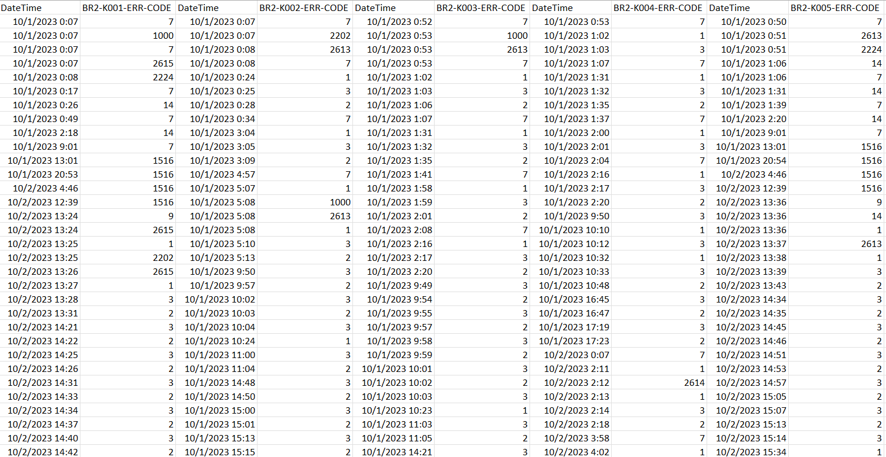

## Time Weighted Average (PI)
When the term "10 minute average PI data" is used in the context of AI2 this means, with respect to PI, a time-weighted average. The time-weighted average is calculated by considering both the value and the duration of each data point. This method ensures a more accurate average for process data, particularly when data points are unevenly spaced over time, by giving greater weight to values that persist for longer periods. This approach is essential when the underlying data is stored in a [compressed](#compressed-data) format. 

In the [download utility](#pi-download-utility) time weighted average data is requested like this: `("SELECT [time], [value] FROM piarchive..piavg WHERE tag =('PDK-T001-KW') AND [time] BETWEEN '###' AND '###' AND timestep='10m' ORDER BY  [time]`

The output looks like this:  
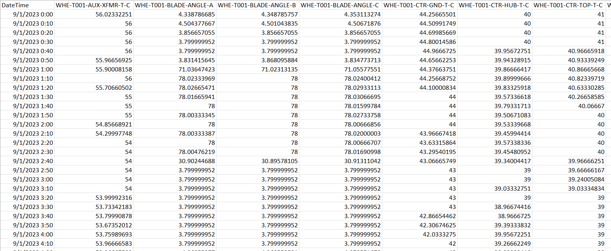

## Sampled Data (PI)
In the OSIsoft PI System, interpolated sampled data is retrieved by estimating data points at specific intervals from the PI Data Archive, where the original data may have been recorded irregularly. When a request is made with defined start and end times and a desired sampling interval, the system interpolates values for these intervals using existing data points. It calculates these interpolated values based on the nearest actual data points even when there are gaps or irregularities in the underlying [compressed](#compressed-data) dataset.

In the [download utility](#pi-download-utility) sampled data is requested like this: `("SELECT [time], [value] as value  FROM piarchive..piinterp2 WHERE tag =('PDK-T001-KW') AND [time] BETWEEN '####' AND '####' and timestep='10s' ORDER BY  [time]"`

Output looks like this:  
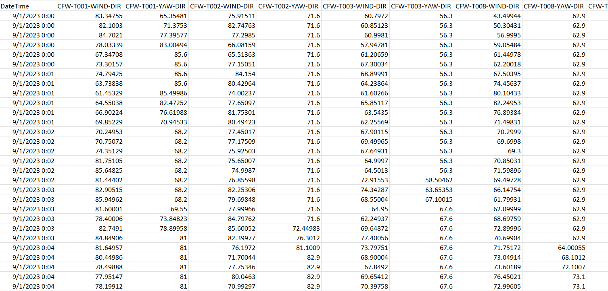

## PI download Utility
This is a custom .Net utility used to retreive data from PI necessary for AI2. It uses the PIOLEDB library to interface with the PI Archive, downloading tag names directly from the archive in the specified way - [compressed](#compressed-data), [average](#time-weighted-average-pi), or [sampled](#)

## Normally Operating
Normally operating in AI2 refers to turbines that are producing power and are exhibiting normal valid data. This is operationalized by the [online filtering](data_cleaning_and_filtering.md#online-filtering) process. 

# AI2 Meta Data
## OEM Power Curve
The official warranted power production at wind speeds across the operational range of the particular turbine technology.

The OEM power curves are found in the AI 2 project directory at `assets\data\power_curves\all_power_curves.csv`. 

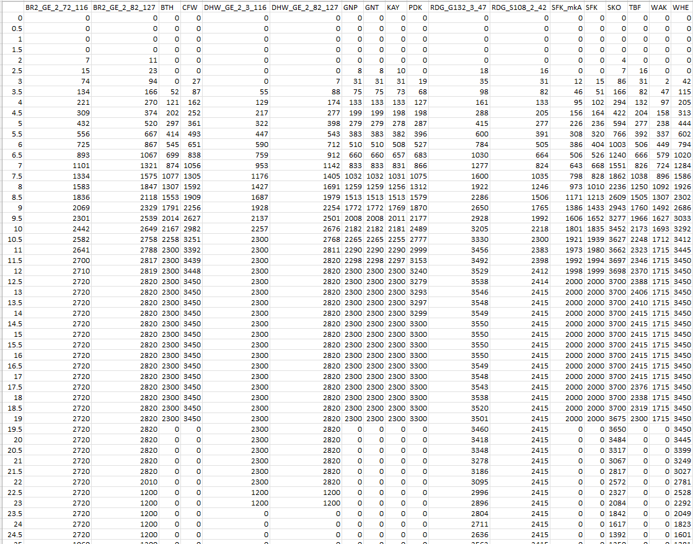

### Bin Centering
An important detail about OEM power curves is the the wind speed bins down the left most column represent the ***center*** of each bin. So the 4.5 m/s wind speed bin, for example, represents the averages power production from 4.25 m/s to 4.75 m/s. 
## Project Wind Speed Distributions
Each project has a static wind speed distribution that is used to calculate theoretical AEP numbers. These come from power performance testing results or pre-construction energy reports.

The windspeed distributions used for AI2 are located at `assets\data\all_ws_dist.csv`
## Revenue Per MWh
Definition provided by SPC mapping each time stamp and project to a dollar per MWh price.Currently the prices only change with each month but the structure of this lookup file is hourly so that when hourly resolution pricing information is received it can be plugged in and will reflect in the application. 

It is found at `assets\data\RevenuePerMWh.csv` in the AI2 project structure and looks like this:

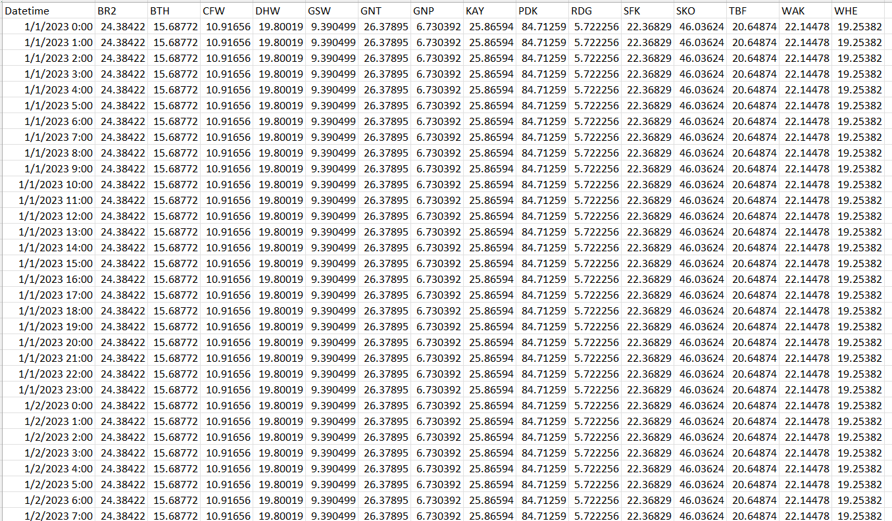

