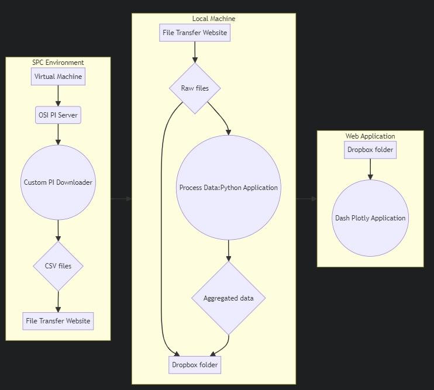
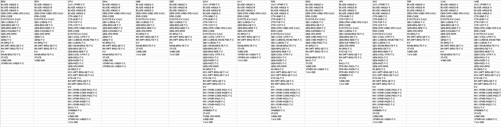

"Data Preparation" is meant to convey the process by which raw data is prepared to run through the transformation engine. 

# Offline Data Flow (Obselete)

This was the general flow of data during the 2023 offline Proof of Concept:

PI Data was first manually downloaded from the OSI PI Archive within SPC. This was done from an SPC Virtual Machine using a custom .NET application to make calls to the archive directly using PIOLEDB. 
The resulting CSV files were saved locally and then manually uploaded to a file transfer website (xtr.southernco.com) and downloaded from a ReGenerate local Machine. The raw files were then processed into the necessary form for aggregation. Aggregated output was saved to a Dropbox folder. A web server hosted on a virtual machine within ReGenerate's Azure Environment had access to this same dropbox folder and hosted a dash plotly web application that loaded the aggregated and raw files into a model and served visualizations through the [web application](https://webportal.trendlineinsights.com/aiid). 

## Interim Application Use 
At the time of handover to SPC in December of 2023, the plan for immediate use was that the [User Interface](ui_model.md) would be run on local users' machines utilizing dash's included development server. (A light weight dash server that runs on an individual's machine and renders to the loopback address -> http://127.0.0.1:8050/) while the [transformation engine](transformation_model.md) would be run in Azure on a scheduled job utilizing SPC's Harbor Master. 

# Tags Needed 

Here are all of the Tag types needed per turbine per project:


## Average Data
- Retrieved as a [10 minute (time weighted) average](data_dictionary.md#time-weighted-average-pi) directly from PI, one file per project.
- Total 10 min Average Tags: 19,767
- Resolution: 10 Min
- 144 rows per day per tag  


## Sampled Data  
 -  Retrieved as [10 second sampled data](data_dictionary.md#sampled-data-pi) from PI.These are exclusively the yaw direction and nacelle wind direction tags.  
 - Total tags for Yaw: 1,624
 - Resolution: 10 sec 
 - 8640 rows per day per tag


## Compressed Data 
 - Retrieved as [compressed data](data_dictionary.md#compressed-data) from PI. 
 - Total compressed tags: 2,023
- Resolution: irregular
- varying row count per day per tag

 

## Raw Data Files and Folders
### Folder Structure
As long as you are running the transformation engine locally you will need to have the file in particular folders so the application can ingest them without issue. 

The raw data files should be placed by download type in 3 folders with this exact structure:

```
southernoperations/
└── AIID/
    ├── AVG/
    ├── CMP/
    └── YAW/
```
 where southernoperations is a folder in the root of the project directory. 

 ### Files
 You need to set up the download of the data to produce 1 10 minute average file per project, which will go in the **AVG** folder, 1 compressed file per project which will go in the **CMP** folder, and 1 10 second sample file per project, which is to go into the **YAW** folder.

 The files can be named anything just so long as the only columns found inside each file belong to a single project and that is the only AVG, CMP, or YAW file that contains data for that project. 


