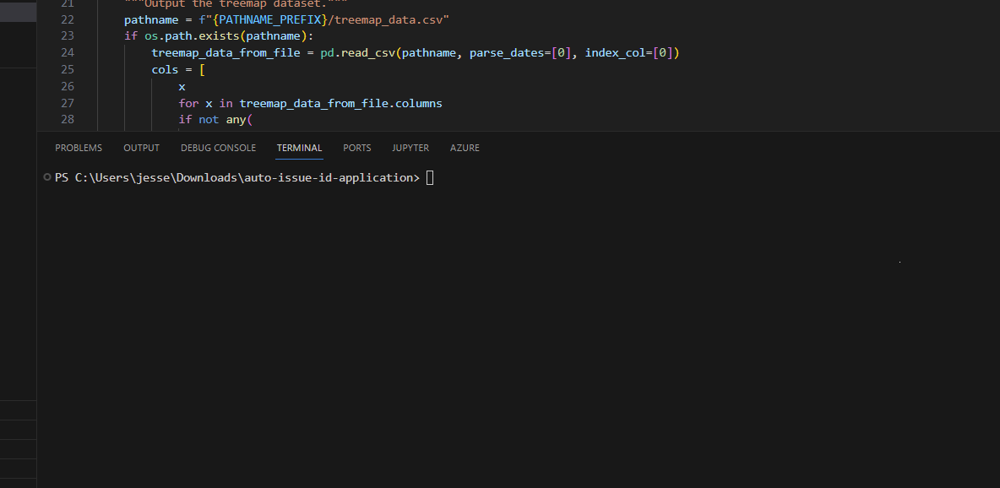
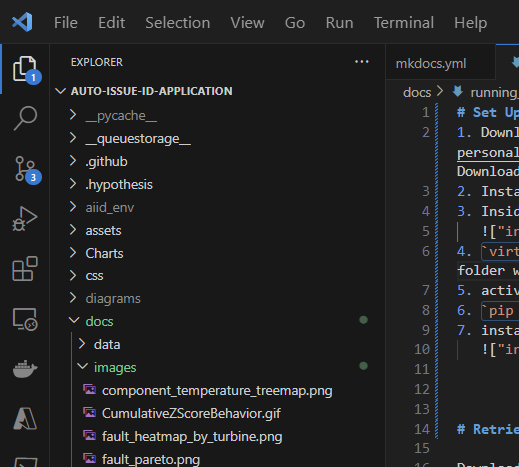
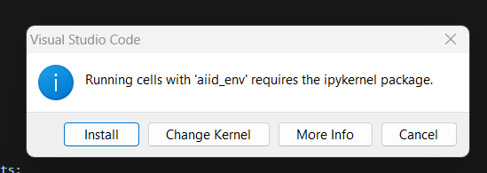
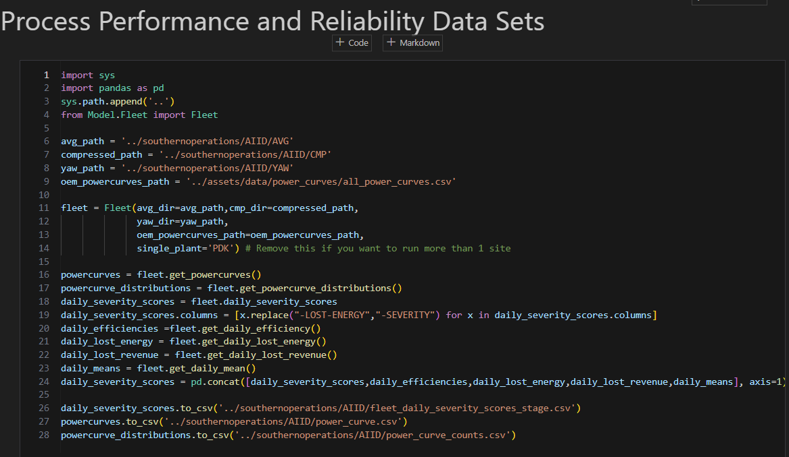
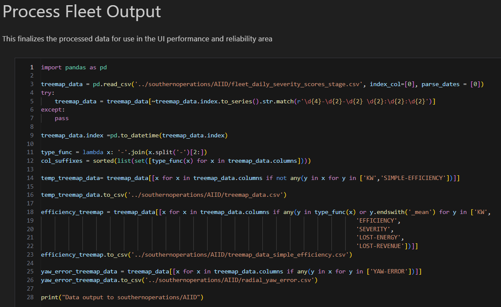
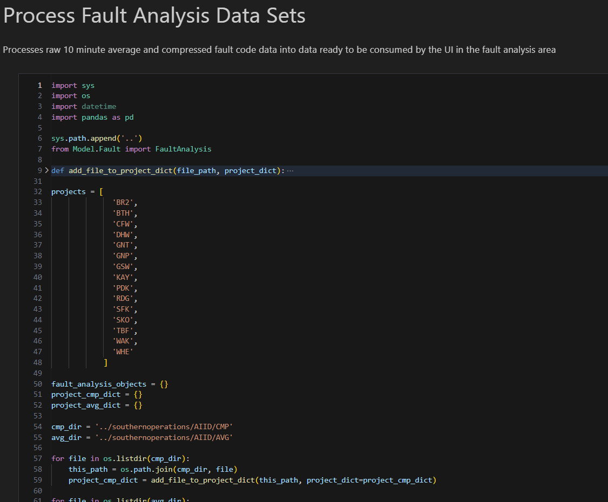
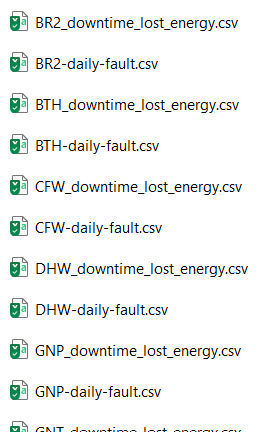
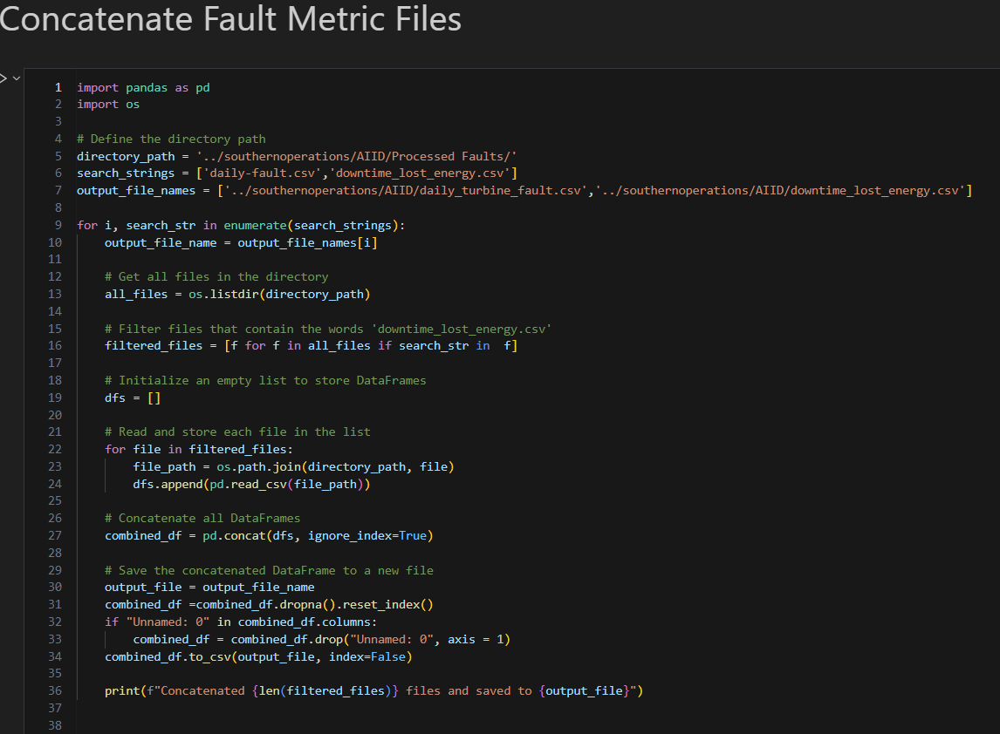
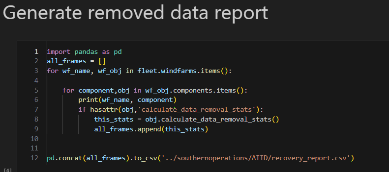
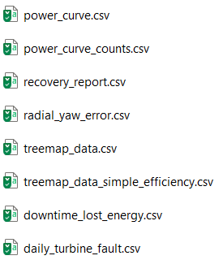

# Set Up The Environment 
1. Download the code from [SPC Sharepoint](https://soco365-my.sharepoint.com/:f:/r/personal/tswatts_southernco_com/Documents/Buckets/AI%5E2?csf=1&web=1&e=UNmvKA)Download current code and data
2. Install and Open [Visual Studio code](https://code.visualstudio.com/Download)
3. Inside VS Code, Open an integrated terminal `ctl + ~`
   
4. `virtualenv aiid_env` to create a virtual environment. The virtual environment folder will appear in the root of the project file structure.   
   
5. activate the environment `./aiid_env/Scripts/Activate.ps1`
6. `pip install -r requirements.txt` see [packages](#requirements-packages) below.
7. install jupyter notebooks extension as prompted  
   

# Requirements (Packages)

1. **Dash** (`dash==2.10.2`): [Dash Official Website](https://dash.plotly.com/)
2. **Dash Bootstrap Components** (`dash-bootstrap-components==1.5.0`): [Dash Bootstrap Components Documentation](https://dash-bootstrap-components.opensource.faculty.ai/)
3. **Gunicorn** (`gunicorn==20.0.4`): [Gunicorn Official Website](https://gunicorn.org/)
4. **Openpyxl** (`openpyxl==3.1.2`): [Openpyxl Documentation](https://openpyxl.readthedocs.io/en/stable/)
5. **Plotly** (`plotly==5.15.0`): [Plotly Python Graphing Library](https://plotly.com/python/)
6. **SQLAlchemy** (`SQLAlchemy==1.4.47`): [SQLAlchemy Official Website](https://www.sqlalchemy.org/)
7. **SciPy** (`scipy==1.5.4`): [SciPy Official Website](https://www.scipy.org/)
8. **Pandas** (`pandas==2.1.4`): [Pandas Official Website](https://pandas.pydata.org/)
9. **Python Dateutil** (`python_dateutil==2.8.2`): [GitHub - dateutil](https://github.com/dateutil/dateutil)

# Retrieve the necessary data

Download from PI the following tags (the tag files are downloadable by clicking the links):  

   - [10 Minute Average Tags](data_dictionary.md#time-weighted-average-pi): Retrieved as a 10 minute (time weighted) average directly from PI, one file per project.   
   - [10 Second Yaw Tags](data_dictionary.md#sampled-data-pi): Retrieved as 10 second sampled data from PI. One file per project.   
   - [Compressed tags](data_dictionary.md#compressed-data): Retrieved as compressed data from PI. note that each data column will have its own corresponding datetime that will not align with the columns' datetimes. One file per project.   

1. The average file should be one per project and in the directory `southernoperations\AIID\AVG`.
2. The compresed file , one per project, goes in `southeronoperations\AIID\CMP`. 
3. The Yaw file goes in `southernoperations\AIID\YAW`.

## File Date Ranges Dictate what is Shown in the UI
Currently, the only way to define the length of time that the application processes and reports on is by the date ranges found in the raw input files. This doesn't mean that you can not select a portion of time inside that date range once it is loaded into the application, but by default the Transformation Engine processes and makes available all that it is given. This applies more aptly to the case where we would like to limit the date range of one type of file. Yaw Direction files, for example,  are 10 second data and too much of that data can actually crash the program. For yaw error the team decided it was interested most in the current status of misalignment across the fleet so we can see that adequately with a couple of weeks of data, where as all of the other types of analysis use 10 minute data so more can be analyzed in those areas.  

# Transform Raw Data 
Here is the process to run the data transformation in a Jupyter notebook called `WALKTHROUGH.ipynb` included in  the project files. 

[Here](transformation_model.md) are more details on how the code accomplishes this. 

 Open the Jupyter Notebook `WALKTHROUGH.ipynb` and run the transformation scripts.  The notebook cells to run are named exactly as follows.  
## Process Performance and Reliability Data Sets
   
   This outputs an intermediary file named `fleet_daily_severity_scores_stage.csv` and the [power curve files](data_dictionary.md#power-curve-data-set).The `fleet_daily_severity_scores_stage.csv` will be split into files that are consumable by the UI in the following step. This file is not yet useable. 
## Process Fleet Output
     
   This performs post-processing on the `fleet_daily_severity_scores_stage.csv` from step 1 above, breaking that file into three files:
   [treemap_data.csv](data_dictionary.md#treemap), [treemap_data_simple_efficiency.csv](data_dictionary.md#treemap-data-simple-efficiency), and [radial_yaw_error.csv](data_dictionary.md#radial-yaw-error). 
## Process Fault Analysis Data Sets
   
   This step produces two files **per project** saved to `southernoperations/AIID/Processed Faults`:  a daily fault file and a downtime lost energy file. the next step will perfrom some post processign to put all of these files into a single fiel for the UI to consume.   
   The per project results in the `Processed Faults` Folder are as shown below:  
   
## Concatenate Fault Metric Files
   
   This step produces two files: [daily_turbine_fault.csv](data_dictionary.md#daily-turbine-faults)

## **Generate Removed Data Report**  
   

## Final Files
After all of the above steps complete successfully you will have the following files in the `southernoperations\AIID` directory. These are ready for the UI to consume directly.   

# Run the UI locally
1. in VS code press `ctl + ~` to open a power shell integrated terminal window. 
2. Activate the aiid virtual environment by typing the comman `./aiid_env/Scripts/Activate.ps1`. (aiid) should now preceed the prompt. 
3. Run the web application locally by typing `python index.py`. It will notify you that its is now running on 127.0.0.1:8050.
4. Navigate in a web browser to 127.0.0.1:8050.  

# Future Considerations
As the application becomes integrated into the enterprise architecture, there will be need to retrieve data via more robust means than were employed during the proof of concept phase of this project. There are some things of note with this in mind. 
## Changing Raw Data
It is likely that the Transformation engine will run daily or weekly and the datasets being accumulated will need to be rerun due changing raw data after calculations have previouslly been completed as with PI Back Filling.  There will need to be a mechanism in the pipeline created that considers whether the raw data has changed. If it has then system determines it should re-process and  overwrite. Other wise the system only needs to process the incremental days beyond the last time of update and append them to the final datasets.  
## Distributed Processing 
The runs currently for a few months of data can take some time - on order of hours. While we made the optimizations we could in development, there will be other opportunities to speed the run time. One way would be distrubted processing. The code structure is conducive to this as `WindFarm` objects encapsulate operations that do not depend on other instances of `WindFarm``. This however would involve modifying or extending the code - specifically the way the objects are called and their results aggregated -  to run in a distrubuted manner.
## Database Connectivity
It will be desireable to load transformed data into a database that then serves the application directly, without the need for marshalling files. 
There is essentially a [stub of a class](reference.md#auto-issue-id-application.Model.DataAccess.MSSQL_Repository) created with this intent in mind. 

