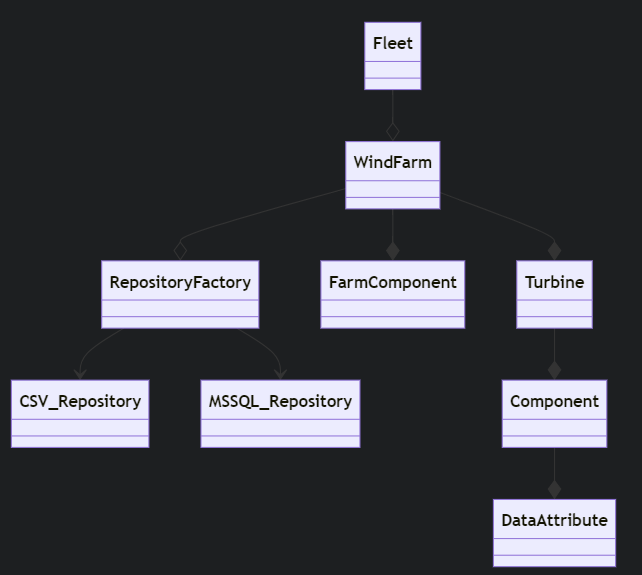
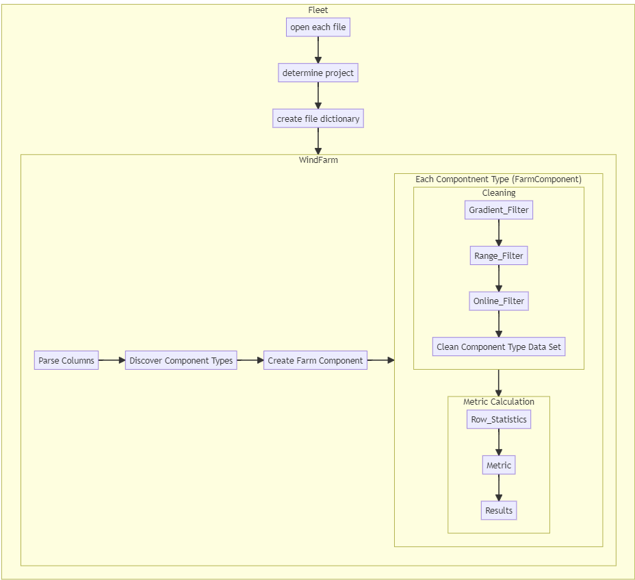
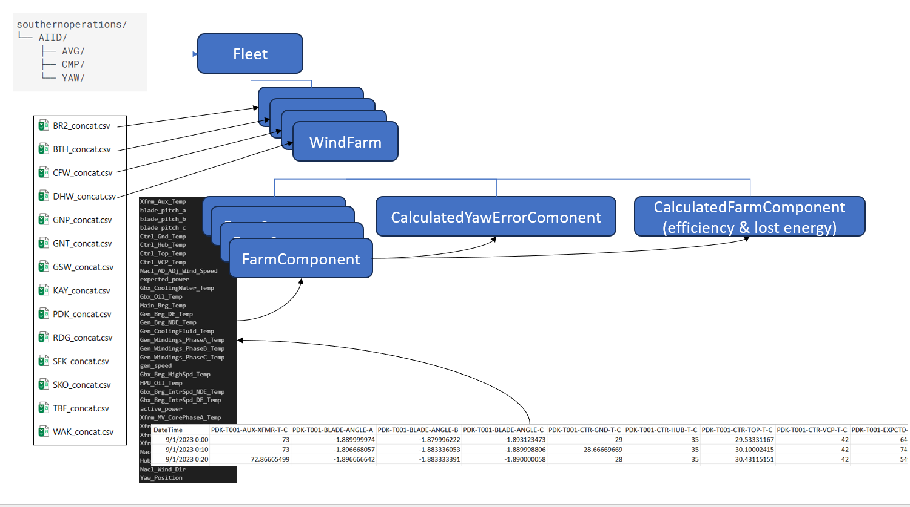
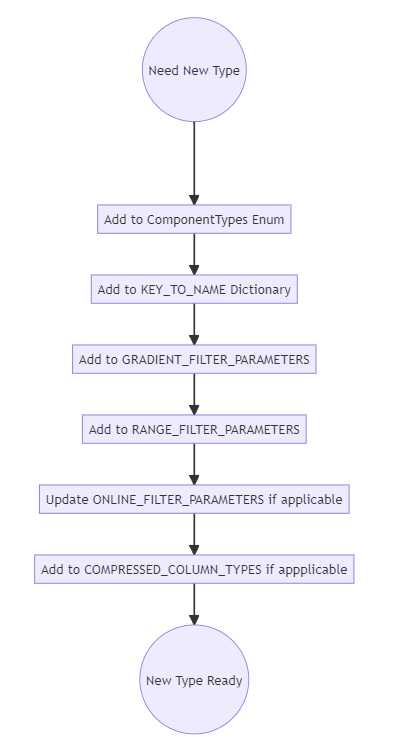

# Results of the data transformation

This section describes the structure and use of the final datasets produced by the AI <sup>2</sup> transformation engine. 

A [full run](running_the_application.md#transform-raw-data) produces 7 files:

1. [treemap_data_simple_efficiency.csv](data_dictionary.md#treemap-data-simple-efficiency) 
2. [power_curve.csv](data_dictionary.md#power-curve-data-set)
3. [power_curve_counts.csv](data_dictionary.md#power-curve-bin-counts)
4. [treemap_data.csv](data_dictionary.md#treemap)
5. [radial_yaw_error.csv](data_dictionary.md#radial-yaw-error)
6. [daily_turbine_fault.csv](data_dictionary.md#daily-turbine-faults)
7. [downtime_lost_energy.csv](data_dictionary.md#downtime-lost-energy)

Each feeds data to different areas of the UI.

# The Transformation Run Process in More Detail
## Fleet
The fleet object is the entry point to the application and it assembles calcultions from component windfarms. 

### Fleet Initialization
On initialization `Fleet` does 2 things: 
1. It takes the folder paths you give it for `CMP`,`AVG`, and `YAW` and reads the first row of each file to determine which project each file belongs to. It then stores the paths of the files in a dictionary for later access. 
2. It creates a `WindFarm` object for each project  found in the `AVG` file dict.  Since we always need 10m minute average for each project, this is a good representation of all the projects we'll need to analyze. the [WindFarm](#windfarm) objects are stored in the [windfarms](reference.md#auto-issue-id-application.Model.Fleet.Fleet.windfarms) property.
Note that if a project contains subsets of turbines, where there are multiple groups of turbines that operate differently, and therefore must be analyzed separately, one `WindFarm` object is created per subset. The subset definition that is used to determine if a project has subsets and if so which turbines specifically belong to each subset is housed in the [PROJECT_SUBSETS](reference.md#auto-issue-id-application.Utils.Constants.PROJECT_SUBSETS) dictionary in `Utils.Constants`

## WindFarm
`WindFarm` represents the physical plant or Windfarm. 
For each windfarm object that `Fleet` creates, the following things get set up:
1. Components:`WindFarm.get_component_types` calls [Helpers.Utils.get_component_types](reference.md#auto-issue-id-application.Utils.Transformers.get_component_types)
which takes as a parameter,  the dataframe to be processed and the component_type_func(`Utils.Constants.DEFAULT_PARSE_FUNCS["component_type_func]`) that will be used to get the component type names from the tag names. 

Each column is iterated over and the type suffix extracted. The tag type suffix is then passed in to [Utils.Helpers.component_type_map](reference.md#auto-issue-id-application.Utils.Transformers.component_type_map).

[Utils.Helpers.component_type_map](reference.md#auto-issue-id-application.Utils.Transformers.component_type_map) then looks in [Utils.Constants.KEY_TO_NAME](data_dictionary.md#key_to_name) to see if the suffix is in the dictionary. if it is, the humanized name (which is a `ComponentTypes` Enumaration value) is returned. if its not then None is returned. 
if none is returned then [Helpers.Utils.get_component_types](reference.md#auto-issue-id-application.Utils.Transformers.get_component_types) continues to the next column and the column that had a suffix that was not mapped is simply skipped and it will not be available to the application for use in analysis. 


## Farm Component
when a data set is loaded via 
```python
wf_obj = WindFarm(...)
```

All columns are parsed and the different types of components found in the file are grouped together. The types are defined by a preset list and correspond to the "type" portion of each pi tag name. 

For each type that is found a FarmComponent object is created and stored as a property named as the component type found. For example if '-KW' is found in the file the component type is translated to 'active_power' and becomes a property -> `wf_obj.active_power`

the active power farm component represents the farm active power and various things are available by accessing it:

1. For each aggregation type avg, max, min, std, median , and sum _gradient, _gradient_stats, _range, _range_stats, _online, and _online properties are created so that we have for example:  
```python 
wf_obj.active_power._avg,  
wf_obj.active_power._avg_gradient, 
....
```
when any of the bare aggregate properties are called,  if that property has not yet been calculated, the statistic is calculated with the `statistic` method. 

The `statistic` method itself first calls for clean data. Clean data means the combined result of gradient, range, and online filtering (if applicable). This cleaning is executed if it has not been done yet when the `clean_data` property is requested. `statistic` then removes missing values from the clean data set  and calculates the row wise statistic. if `wf_obj.active_power.mean` is called, for example, then `statistic` calculates the row mean for active power of all non missing values on the clean data.
### Cleaning
`FarmComponent` encapsulates the [cleaning](data_cleaning_and_filtering.md) process and exposes the dataset at each stage.  Because all of the data partitioned into each `FarmComponent` object is of the same type the cleaning algorithms can be efficiency applied to multiple columns at once. 

### Calculating Severity 
(**Relative Variation**)

[FarmComponent.get_severity_scores](reference.md#auto-issue-id-application.Model.WindFarm.CalculatedFarmComponent.get_severity_scores) identifies significant deviations from the norm for each turbine-component over time and aggregates these deviations into a daily severity score.  

1. **Calculate Row Mean and Standard Deviation:**
  Calculate the mean (`row_mean`) and standard deviation (`row_std`) for each row in the [clean_data](reference.md#auto-issue-id-application.Model.WindFarm.FarmComponent.clean_data) DataFrame, excluding any values less than -1000. This step computes the average and variability of each time point across all turbine-components.

2. **Calculate Z-Scores:**
  Z-scores are calculated by subtracting the row mean from each data point in [clean_data](reference.md#auto-issue-id-application.Model.WindFarm.FarmComponent.clean_data), a property on the [FarmComponent](#farm-component) object, and then dividing by the row standard deviation. This step normalizes the data, measuring how many standard deviations each data point is from the row mean.


3. **Rolling Window Calculation:**
  Apply the rolling method to `masked_z_scores` with a window size defined by the `period` argument (default '6H' for 6 hours). This creates a rolling window for calculating cumulative metrics over time.

4. **Calculate Window Sums:**
  Calculate the sum of z-scores within each rolling window (`window_sum`). This sum represents the cumulative severity over each window.

5. **Calculate Window Severity Frame:**
  Calculate the count of non-zero z-scores (`window_counts`) in each window. These counts are then converted to proportions (`window_proportion`) by dividing by the total possible count (36, assuming 6-hour periods).
  Compare the proportion of each window against `density_thresh` (default 0.9). Windows with proportions less than this threshold are set to NaN.
  Calculate the final window severity frame (`window_severity_frame`) by summing `window_sum` over the rolling period again.
  Severity scores in windows with insufficient data density (as per `window_proportion`) are set to 0.

6. **Group by Day and Calculate Daily Sums:**
  Group the severity scores by day and calculate the daily sums. This provides a daily severity score for each tag.

7. **Return Daily Severity Scores:**
  The function returns a DataFrame containing the daily severity scores, with the index containing the date and columns corresponding to each turbine-component.


## CalculatedFarmComponent
The purpose of a CalculatedFarmComponent object is to provide the conceptual encapsulation for a new data stream that is the result of combining multiple FarmComponent objects, or at least the (cleaned) data from them. 

This generalization in actuality only represents three types of composite data in the application which are [Power Performance Lost Energy](reference.md#auto-issue-id-application.Model.WindFarm.CalculatedFarmComponent.daily_lost_energy), [Power Performance Efficiency](reference.md#auto-issue-id-application.Model.Fleet.Fleet.get_daily_efficiency), and [Power Performance Lost Revenue](reference.md#auto-issue-id-application.Model.Fleet.Fleet.get_daily_lost_revenue). These datasets are displayed, as indicated by thier names, in the [Power Performance Treemap](ui_model.md#power-performance-treemap). 

### calculate_simple_efficiency
[Efficiency](data_dictionary.md#efficiency) represents the fraction of energy that the turbine could have produced compared to what it did produce. 
[Efficiency](data_dictionary.md#efficiency) and [Lost Energy](data_dictionary.md#lost-energy) (while the turbine is normally operating) are both calculated in the `CalculateFarmComponent` object with the [`calculate_simple_efficiency`](reference.md#auto-issue-id-application.Model.WindFarm.CalculatedFarmComponent.calculate_simple_efficiency) method. 

Here is the process:  

1. **Check for Daily Threshold**: 
   - Set the daily data recovery threshold; defaults to 0.9 if not specified.  
2. **Identify Turbines**: 
   - Extract turbine names from the DataFrame columns.  

3. **Prepare Data Frames**: 
   - Initialize empty DataFrames for lost energy and efficiency.  

4. **Iterate Through Each Turbine**: 
   For each turbine, perform the following steps:
   1. **Filter and Clean Data**:
      - Filter the input DataFrame for active and expected power columns relevant to the current turbine.
      - Drop records with missing data and apply the daily threshold filter.
      - Reindex the filtered data to a complete date range and fill missing values with NaN.

   2. **Calculate Lost Energy**:
      - Compute the lost energy as the difference between active power and expected power, scaled appropriately.
      - Store the lost energy in the `lost_energy_frame`.

   3. **Set Up Rolling Window Calculation**:
      - Define a rolling window size (24 hours) with a minimum valid count for data points.
      - Calculate rolling sums for active power and expected power over the defined window.

   4. **Handle Zero Denominator Cases**:
      - Replace zeros in the denominator (expected power rolling sum) with ones to avoid division by zero.

   5. **Calculate Efficiency**:
      - Compute efficiency as the ratio of the rolling sum of active power to the rolling sum of expected power.
      - Fill missing values in the efficiency calculation with -9999.

5. **Return Results**:
   - Return two DataFrames: one for lost energy and the other for efficiency, each with columns corresponding to different turbines.


## Fault


### Downtime, Lost Energy, and  Lost Revenue

`Fault.calculate_metrics` calculates `downtime_lost_revenue.csv` values 

- isolates ERR-CODE columns and DateTime Columns
- maintain their positions so they can be associated when each turbine is iterated later
- build an initial dataframe, setting the `StartDateTime`, `FaultCode`, and `Turbine`
- clean out values that have missing fault codes or startDateTimes
- merge contiguous valid intervals 
- find overlaps between valid power segments and fault starts and ends 
- set starts and ends of each segment to where overlaps between fault event and valid power values start and end 
- if there is contiguous data following the end of a fault, attribute that downtime  to the original fault code 
- calculate lost revenue by extracting the start days and hours and mapping into the revenue by mwh metadataset
- return final downtime lost revenue file 

## Power Curve Calculation: Transformation Engine

The calculation of power curves is accomplished in a series of simple steps: 

1. Retreive [cleaned](data_cleaning_and_filtering.md#ai-2-clean-data) [air density adjusted wind speed](data_dictionary.md#air-density-adjusted-nacelle-wind-speed) from the [ WindFarm.Nacl_AD_ADj_Wind_Speed.clean_data](reference.md#auto-issue-id-application.Model.WindFarm.FarmComponent.clean_data) property.
2. Retreive [cleaned](data_cleaning_and_filtering.md#ai-2-clean-data) [active power](data_dictionary.md#active-power) data from [ WindFarm.active_power.clean_data](reference.md#auto-issue-id-application.Model.WindFarm.FarmComponent.clean_data) property.
3. [Active power](data_dictionary.md#active-power) data and [air density adjusted wind speed](data_dictionary.md#air-density-adjusted-nacelle-wind-speed) data are concatenated together
4. [PowerCurve.get_daily_power_curves](reference.md#auto-issue-id-application.Model.PowerCurve.PowerCurve.get_daily_power_curves) process the input data and prepares it to pass into [PowerCurve.process_turbine_data](reference.md#auto-issue-id-application.Model.PowerCurve.PowerCurve.process_turbine_data) for each turbine's wind speed and active power data.
5. The [PowerCurve.process_turbine_data](reference.md#auto-issue-id-application.Model.PowerCurve.PowerCurve.process_turbine_data) is called and for each turbine
6. [PowerCurve.process_turbine_data](reference.md#auto-issue-id-application.Model.PowerCurve.PowerCurve.process_turbine_data) removes all rows where both wind speed and active power are not valid values.
7. [PowerCurve.process_turbine_data](reference.md#auto-issue-id-application.Model.PowerCurve.PowerCurve.process_turbine_data) creates wind speed bins:
   ```python
    bin_edges = np.arange(-0.25, 20.75, bin_width)
    bin_labels = np.arange(0, 20.5, bin_width)
   ```
   Note that the bin edges are offset from the bin labels by -0.25 m/s. This is how we acheive [centered bins](data_dictionary.md#bin-centering) so that things are comparable with the [OEM power curve](data_dictionary.md#oem-power-curve)
8. [PowerCurve.process_turbine_data](reference.md#auto-issue-id-application.Model.PowerCurve.PowerCurve.process_turbine_data) groups the wind speed and power data by the wind speed bins and takes the average of the power in each bin. 
9. [PowerCurve.process_turbine_data](reference.md#auto-issue-id-application.Model.PowerCurve.PowerCurve.process_turbine_data) groups the wind speed and power data by the wind speed bins and takes the valid data counts in each bin.
10. [PowerCurve.get_daily_power_curves](reference.md#auto-issue-id-application.Model.PowerCurve.PowerCurve.get_daily_power_curves) returns two dataframes:
    1.  [daily power curves](data_dictionary.md#power-curve-data-set)
    2.  [daily power curve bin counts](data_dictionary.md#power-curve-bin-counts) which correspond to [daily power curves](data_dictionary.md#power-curve-data-set)

### Park Average Power Curve Calculation
This is the bin wise mean active power value across all turbines on a plant per day.
For example,

|Turbine   |Day       |3.5 |4.0 |4.5 |5.0|
|----------|----------|--- |--- |--- |---|
|T001      |1/1/2021  |20  |30  |90  |...|
|T002      |1/1/2021  |25  |33  |94  |...| 
|T003      |1/1/2021  |22  |39  |97  |...|
|Park Avg  |1/1/2021  |22.3|34  |93.7|...|


There will be one park average row (power curve) per day per plant. 

The Park AVerage is consumed in a single location in the UI in the [Level 1 Power Curve View](user_guide.md#level-i-power-curve-and-aep-and-distribution) 

### Park Average Power Curve Counts Calculation
This is the bin wise sum of counts across all turbines on a plant per day.
For example,

|Turbine           |Day       |3.5 |4.0 |4.5 |5.0|
|-------------     |----------|--- |--- |--- |---|
|T001              |1/1/2021  |10  |10  |15  |...|
|T002              |1/1/2021  |12  |13  |15  |...| 
|T003              |1/1/2021  |10  |15  |11  |...|
|Park Distibution  |1/1/2021  |32  |38  |41  |...|


There will be one park distribution row per day per plant. 

The Park Distribution is consumed in a single location in the UI in the [Level 1 Power Curve Distribution View](user_guide.md#level-i-power-curve-and-aep-and-distribution) 

# Turbine
On parsing the input data, individual turbines are identified.For each turbine found a `Turbine` object is created, and the turbine objects for each farm are accessed via dictionary like `wf_obj.turbine['WAK-T001']`. 

The `Turbine` object is initialized with the data that belongs to that turbine and that is stored with the object. 

On creation of the `Turbine` object dynamic properties are created corresponding to the component types found in the turbine's data. 

For example, `wf_obj.turbines['WAK-T001].active_power` is created dynamically from the dataset. 

## Turbine Component
For each component type found in the turbine's data, a `Component` object is created on the turbine object. When each component object is created. `DataAttribute` objects are also created and assigned to properties whose names are the aggregate types.  For example `wf_obj.turbines['WAK-T001'].active_power.mean` is a `DataAttribute` object. 
Finally, each `DataAttribute` object has properties that correspond to the states of that data; such as `clean, raw, gradient`, and so on. 

If we then wanted to retrieve clean active power data for a turbine it would be called  like this: 
`wf_obj.turbine['WAK-T001].active_power.clean`


# Model
## Model Classes
  

## Model Object Flow


## Object Cardinality
This is how the structure of the data maps into the structure of objects that are created 


## Configuring a New Type to be Processed
When new types need to be added for processing a few steps need to be completed to get things set up. 



If you add a new tag type to the input file and want to it to be picked up by the application. follow these steps:  
1. Add the new type to Utils.Enums.ComponentTypes  
2. Add the suffix as key  and new enum value to the KEY_TO_NAME dictionary.  
3. Add definition to  GRADIENT_FILTER_PAEAMETERS keyed with ComponentTypes enum value  
4. Add definition to RANGE_FILTER_PARAMETERS keyed with ComponentTypes enum value  
5. Update definition in ONLINE_FILTER_PARAMETERS if the new type is part of online filtering for any sites  
6. if the new type originates from compressed data, add the ComponentTypes enum value of the new component to COMPRESSED_COLUMN_TYPES 


