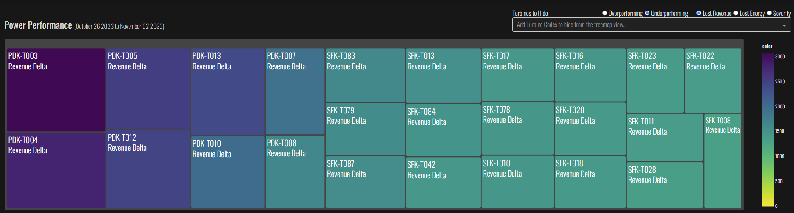
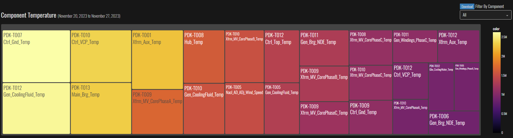

# User Interface 

This page details data transformations in the underlying user interface code after the UI files have been generated by the [Transformation Engine](transformation_model.md) and are ingested by the UI.

## Dash
[Dash](https://dash.plotly.com/) is an open-source framework for building interactive web applications using Python (and also R or Julia). It's built on top of Plotly, which is a library for creating interactive graphs and data visualizations, and integrates with Flask for the web server backend, React.js for the frontend, and Plotly.js for the interactive graphics.

## The UI Landscape

#### Callbacks

While our tools provide the capabilities for interactivity that we are after, there is still a level of hookup required to get everything to work.

In our Dash app, interactive charts are updated by callbacks. A callback is simply code that updates part of an app. Specific callbacks fire when front-end components, such as sliders, buttons, widgets and controls, change or are pressed. In-turn, something on the screen will most likely change.

If we narrow our focus to the charts in the app, we know there is always a callback that is making it update. The callback is invoking a Plotting Function (see diagram below), plugging in all the necessary data, and thus creating the new parameters that get sent to the chart already sitting in the app.

After a callback has finished running, the front end will update.

#### File Structure

All the code for the Plotting Functions, Callbacks, Charts, and everything else is organized into files (also called modules) which sit inside folders. Nearly all the code we care about is found here:

We can build a more complete picture of both the code chunks and the file structure by combing them into a single picture. All the UI Functionality is broken up into functional chunks as shown below: 

## Walking Through the Application

Once you enter the app, you are greeted with a portal to the app's two pages:
- The Performance & Reliability Page
- The Fault Analysis Page

From here, depending on the kind of analysis you are interested in engaging with, you may enter either the Performance & Reliability Page, which contains 3 charts.

</img>

Or the Fault Analysis Page, which also contains 3 charts:

</img>

### Performance & Reliability Page

#### Power Performance Treemap

#### Component Temperature Treemap

#### Yaw Error Chart

### Fault Analysis Page

#### Pebble Chart

#### Fault Treemap

#### Pulse and Pareto Chart

### The Sub-Charts

## Calculations and Transformations

Some calculations need to occur in the UI layer to provide more responsive interactivity. This section details these operations. 

### Annual Energy Production Calculation

[AEP](data_dictionary.md#annual-energy-production) is calculated anew each time the user changes turbine selections or date ranges in the Level I or II view of power curves. 

Level I [AEP Delta %](data_dictionary.md#annual-energy-production-delta-percent):  

  
 

Level II (Neighbors) [AEP Delta %](data_dictionary.md#annual-energy-production-delta-percent)  

Annual Energy Production is the amount of energy in MWh generated by a turbine over the course of one year or 8760 hours. Typically AEP is caluculated as the sum product of the binned power curve and the binned [wind speed distribution](data_dictionary.md#project-wind-speed-distributions).

In A2 we apply the same [wind speed distribution](data_dictionary.md#project-wind-speed-distributions) to any power curve derived by the user either by selecting a particular turbine in the level 1 or level 2 analysis or adjusting the date range. The AEP Metric in AI2 is a theoretical one. The calculation yields the annual energy that a given power curve, even if it is only derived from a few days of data, would produce. 

#### Where and how AEP is calculated in AI 2
#####Level I

1. User clicks on a [power performance treemap](user_guide.md#power-performance-treemap) cell and loads either [Level I](user_guide.md#level-i-power-curve-and-aep-and-distribution) power curves or [Level II power curves](user_guide.md#level-ii-neighboring-turbine-power-curve-comparison-and-aep-delta).
2. Use OEM Power Curve: Directly uses oem_power_curve as provided generating a matrix of 1's to placehold the distribution which is required for AEP calculation.
3. Collapse the turbine's daily Power Curves over the selected days to a single power curve: [PowerCurve.calculate_weighted_average_power_by_turbine](reference.md#auto-issue-id-application.Charts.PowerCurve.calculate_weighted_average_power_by_turbine) - Computes weighted average power for the target turbine.
4. [PowerCurve.calculate_weighted_average_power_by_turbine](reference.md#auto-issue-id-application.Charts.PowerCurve.calculate_weighted_average_power_by_turbine) - Computes weighted average power for the park average.
5. AEP Calculation Preparation: Checks if [wind speed distribution](data_dictionary.md#project-wind-speed-distributions) is at integer resolution for AEP calculation.
6. Calculate AEPs: [PowerCurve.full_calculate_AEP](reference.md#auto-issue-id-application.Charts.PowerCurve.full_calculate_AEP) - Calculates [AEP](data_dictionary.md#annual-energy-production) for OEM, target turbine, and park average.
Compute AEP Delta Percentages: [PowerCurve.gen_power_curve_traces computes](reference.md#auto-issue-id-application.Charts.PowerCurve.gen_power_curve_traces)  Calculates the [percentage difference in AEP](data_dictionary.md#annual-energy-production-delta-percent)
7.  [PowerCurve.gen_power_curve_traces computes](reference.md#auto-issue-id-application.Charts.PowerCurve.gen_power_curve_traces) Generates Plotly Scatter Traces for power curves and renders to the UI. 

### Other UI Calculations Will Be Added ....