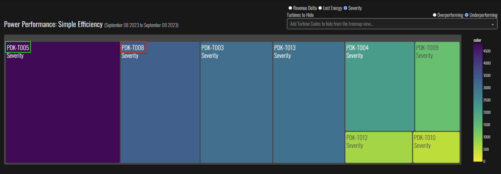
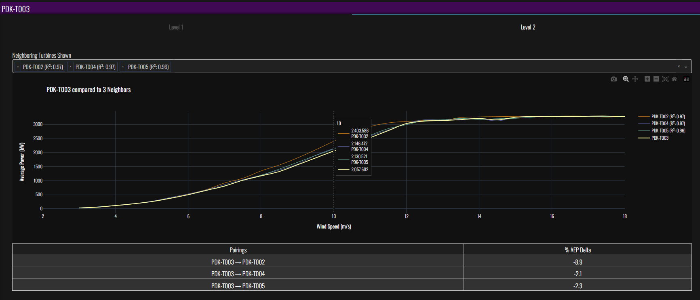

# Auto Issue Identification

This application aims to systematically analyze and compare key dimensions of performance and operation across the turbine fleet, rolling up the results so that the most impacted turbines and issues are highlighted for further investigation.

The application identifies issues in the following 4 main areas:

1. Power Performance  
2. Component Temperatures  
3. Static Yaw Error  
4. Fault Analysis  

## Power Performance
The objective of Power Performance Analysis is to understand which turbines' power production, while [normally operating](data_dictionary.md#normally-operating), deviate the most from the expected production given the inflow and the manufacturer's power curve.  [Raw data](#raw-data-needed-for-power-performance-analysis) are retrieved from PI, [cleaned ](data_cleaning_and_filtering.md), [transformed](transformation_model.md), and rendered to a [treemap](#power-performance-treemap) chart.

#### Raw Data needed for Power Performance Analysis
To analyze power performance we need the following raw data:  
1. [Active Power](data_dictionary.md#active-power) for online filtering,power curves, and efficiency.   
2. [Expected Power](data_dictionary.md#expected-power) for efficiency.  
3. [Air Density Adjusted Wind Speed](data_dictionary.md#air-density-adjusted-nacelle-wind-speed) for power curves.  
4. Generator Speed  
5. [Blade Pitch (Blade A)](data_dictionary.md#blade-pitch-angle) for online filtering.  
6. [Fault Code](data_dictionary.md#fault-code) for online filtering. 
7. [State Code](data_dictionary.md#state-code) for online filtering.  

#### Power Performance Cleaning and Filtering 
To ensure that we are looking only at results produced from periods where the turbines are operating normally and unhindered, the average data is [cleaned](data_cleaning_and_filtering.md#ai2-clean-data) and then filtered for when it is [online](data_dictionary.md#normally-operating). 

### Power Performance Treemap

The [Power Performance Treemap](ui_model.md#power-performance-treemap) allows us to see turbines experiencing the most [lost revenue](data_dictionary.md#lost-revenue) or [lost energy](data_dictionary.md#lost-energy) by selecting the under or overperforming radio buttons along with selecting the [lost revenue](data_dictionary.md#lost-revenue) or [lost energy](data_dictionary.md#lost-energy) radio button. We can also see which turbines differ the most from the rest of the turbines at each respective plant by selecting the [Relative Deviation](data_dictionary.md#severity) radio button.

#### Relative Deviation Vs. Revenue Delta and Lost Energy Rankings

One might presume that the sequential ranking of turbines for each of our 3 metrics would be the same. One might assume that if Turbine A is ranked 3rd in Severity, then it is also ranked 3rd in Revenue Delta against the same set of Turbines. This however proves not to be the case.

#### Example

Let's take PDK on Sept 8th and 9th 2023. 

1. T005:  4803 Severity Score   
2. T008:  3342 Severity Score  

1. T008:  -3.36 MWh  
3. T005:  -2.54 MWh  

Notice that T008 and T005 do not maintain the same rankings between Severity and Lost Energy views.

The short answer is Yes and it is actually by design. One is a relative measure and the other is an absolute measure. 

Further:   
- Lost energy can be low and z-score high if the project standard deviation is low -- meaning it is more likely for the value to be further from the mean in terms of standard deviations.  
- Lost energy can seem high and z-score (severity) can be low if the project standard deviation is high. This means that the given turbine's lost energy value is less likely to be many standard deviations away from the mean.   

Here is the actual data being evaluated and displayed in the treemap rankings above. 

This charts titled "Scaled Severity and Lost Energy" show the raw severity data vs the raw lost energy data for normally operating turbines 8 and 5. The data has been min-max scaled here for easier comparison. On the charts titled "Cumulative Sum of Scaled Values" is shown the cumulative sum of the min-max scaled Lost Energy (in MWh) and Severity (in total standard deviations from the mean). Again, the values have been scaled to a range of 0 to 1 before being cumulatively summed across time to make them more visually comparable.  The severity value is set to zero when it does not exceed 1 std from the park mean of lost energy as detailed in the severity processing steps above. Note that these charts encompass only 2 days, 9/8/2023 and 9/9/2023. But by the end of these two days T008's lost energy is above its Severity whereas T005's severity is above it lost energy. 

Note: In the charts severity is shown as the trace with a name ending in "std-filtered" while lost energy appears on the trace with the name ending in "lost-energy"

We can generally see that this divergence first occurs most significantly  around 04:00 on  the 8th for T005 when it has relatively significant lost energy but zero severity. T008's severity and lost energy remain similar in terms of cumulative sum slope here. Then T008 at 06:00 on the 9th has gained energy (active power > expected power) while severity is at zero. So its severity diverges upward, opposite T005's. 

We are seeing the concept in practice -- that severity is tempered by the park standard deviation. To see this more clearly let’s pretend we have 20 turbines' lost energy values across time. One turbine's lost energy values remains constant while the others change. We can see that as the park standard deviation expands and contracts, exactly the same lost energy quantity assumes higher and lower severity respectively. Again we are fully contextualized by the width of the standard deviation of the park at each time stamp when proclaiming which turbines are "the most severe". In plain language, how far away from the pack were you (single turbine)when we consider your lost energy? Below is an animation of this to make this visually clear. 

### Level I Power Curve and AEP and Distribution

Level I Power Curve Charts allow us to look at a given turbine's measured power curve  vs. the Park Average power curve and the OEM power curve along side the Turbine and Park distributions. We can also see how the turbine we have selected compares in terms of theoretical AEP to the park average curve and the OEM power curve. Seeing the wind speed distributions allows us to understand more about  how a given power curve shape may exhibit a given gross energy profile. Without which, may not make complete sense. 

#### Data Transformation for Level I Power Curves
The transformation engine converts the raw active power and wind speed data to daily power curves that are stored in the `power_curve.csv` file. [Here](transformation_model.md#power-curve-calculation-transformation-engine) are more details.

The `power_curve.csv` file looks like:

In final addition to the `power_curve.csv` file, we need a couple more files:

- The `power_curve_daily.csv`:

- `all_ws_dist.csv`:

#### UI Data Processing

After transforming our data, we are ready to load and prepare the data into a form that is ready for plotting in the application! For charting purposes, we need to convert the data into a Plotly-ready format, as this is the charting library that the application uses.

If you are in the app looking at the Power Performance Treemap, and are interested in a deeper look into a particular Turbine's performance, you may click on its Treemap cell: this will expand the cell, revealing the Level I collection of charts.

**Power Curves Chart**

The Power Curve chart highlights the trendline of the selected turbine, and displays it alongside the park average and OEM power curves. It is calculated from all 3 data files, and plots each power curve by aggregating the data into 0.5 m/s bins and displaying them on the screen.

**AEP Table (Annual Energy Production)**

The AEP section displays the percentage difference between the selected turbine's AEP and the park average AEP. It also displays the percentage difference between the selected turbine's AEP and the Warranted AEP.

**Power Distribution**

If you are interested in a more granular look at the data, the distribution is the place to look. It displays the distribution of the selected turbine's power curve, alongside the park average and OEM power curves. It is calculated from the `all_ws_dist.csv` file, and plots each power curve by aggregating the data into 0.5 m/s bins and displaying them on the screen.

### Level II Neighboring Turbine Power Curve Comparison and AEP Delta

Compare Nacelle Power Curves between neighboring turbines. 

#### Transformation Engine Processing 
Since the Level II Power curves rely on the same power curve data as Level I power curves, [processing](transformation_model.md#power-curve-calculation) is the same. 

#### UI Data Processing

Instead of only focusing on the Turbine you clicked initially, there may be a desire or need to contextualize its performance relative to other Turbines.

Enter the Level II Charts!

**Neighboring Turbine Power Curve Chart**

By tabbing over to Level II, we see a dropdown, a chart, and a table. In this view, we can easily compare other Turbines to our initially clicked Turbine by selected them as options in the dropdown and see their Power Curves appear in the chart.

In the example, the PDK-T003 curve is colored brightly to stand out from the other curves. All our data comes from the data files used in Power Curve files prepared earlier contain all the data we need, so we can use those files to create and update these charts.

**AEP Table**

Similar to Level I, we have the Level II AEP Table. Instead of only comparing the selected Turbine to park averages, it compares the selected Turbine to all the other Turbines plotted in the Chart, producing delta percentages.

     
## Component Temperatures

### Component Temperature Heatmap All Plant Turbines, Single Temperature Type

### Component Temperature Heatmap Single Turbine All Components
Compared to other components on the same turbine

## Static Yaw Error
Plotting average yaw error for the period selected along with the efficiency of those turbines allows us to see which turbines may have the most severe static yaw misalignment.

The chart plots a bunch of thin vertical lines. Each line corresponds to one Turbine, and:

- the average yaw error of that Turbine is represented in the x-axis position.
- the efficiency is represented by the height of the line
	- (the precise number is also displayed when you hover over the line)

#### Yaw Error Data Processing 

The transformation engine converts our raw files into the two files we need:

- `radial_yaw_error.csv`:

- `treemap_data_simple_efficiency.csv`:

#### UI Data Processing

Armed with our yaw error and efficiency file, we now have what we need to put the data into the chart.

By merging the two files together, then taking an average over all the Yaw columns, we create a dataset that is ready to be consumed by the UI.

## Fault Analysis 

The Fault Analysis area allows to look for patterns in fault behavior systematically. 

### Fault "Pebble" Chart

This chart helps us see quickly which Turbines have the highest [Lost Revenue](data_dictionary.md#lost-revenue), [Lost Energy](data_dictionary.md#lost-energy), or [Downtime](data_dictionary.md#downtime)

### Fault Treemap

#### Fault Pareto - Single Turbine

#### Fault Heatmap by Turbine

### Fault Pareto - All Turbines

